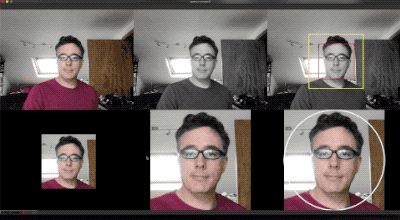
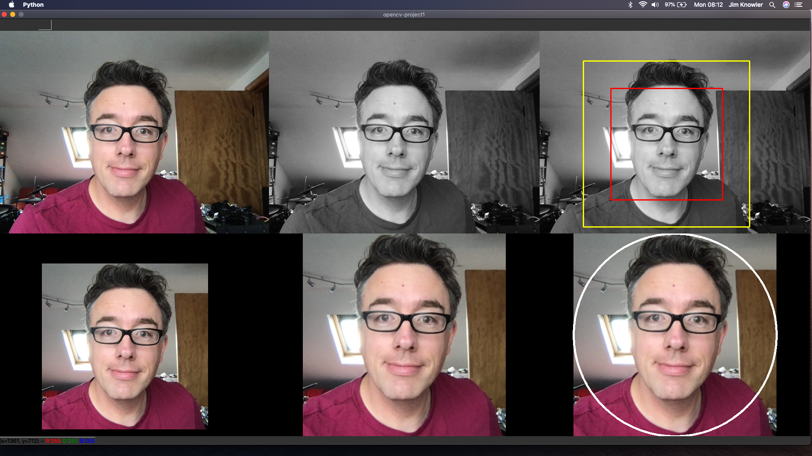
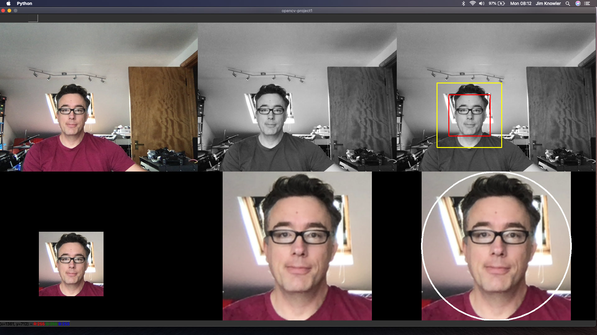
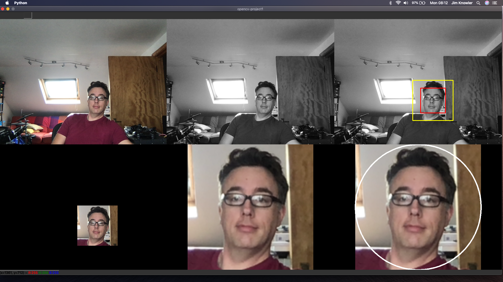
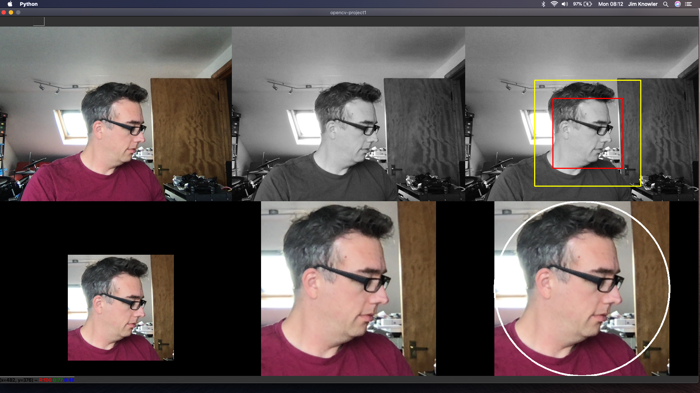

# opencv-project1

# Summary 

A short experiment looking at whether face-detection could be used to help automate capturing a 'selfie' image from a webcam.

For this experiment, a successful 'selfie' will:
- render the customer's face in the middle of a circular 'porthole' seflie
- maximise the size of the customer's face within the 'porthole' selfie

The experiment was time-boxed over weekend of 22nd August 2020 to a couple of hours of [revising basic python Open CV](https://github.com/JimKnowler/spike-python-opencv), and a couple of hours building the demo.

# Processing Stages

The demo generates a video-wall to demonstrate the multiple processing stages that have been implemented.

1. capture rgb video from default webcam as a sequence of images

2. convert rgb image to grayscale

3. use face detection on grayscale image to detect face area
    - the face detection algorithm can detect multiple face areas
      - **face areas are outlined with blue rectanges**
      - *note: if only one area is detected, then the blue rectangle can be overdrawn at next stage in red*
    - the largest face area is selected for use
    - there can be some intermittent jitter between frames as the detected face area can intermittently appear/disappear
      - **the selected + stabilised face area is outlined with a red rectangle**
    - padding is added around the face area
      - padding is used to create a bounding box around a circle that will contain the customer's selfie
      - care is taken to avoid edge conditions at all edges of the image
      - **the padded face area is outlined with a yellow rectangle**
    

4. The original rgb image is cropped using the padded face area

5. The cropped rgb image is resized to use the full size of the image, while maintaining aspect ratio

6. The resized rgb image is rendered in a circular 'porthole'
    - unfortunately this is **unfinished**
    - the next step here would be to apply a mask around the circular outline to trim away the extraneous video frame content

# Requirements

- [Python 3](https://www.python.org/downloads/)
  > developed & tested on v3.8.5 64-bit

- [Python OpenCV](https://pypi.org/project/opencv-python/)
  > $ pip3 install opencv-python

- WebCam
  - Minimum resolution of 640 x 480

Developed & Tested on MacOSX 10.15.6 Catalina, running on a MacBook Pro with a built in webcam

# Instructions

## Demo

The Demo is implemented in python and can be started at the command line

> $ python3 main.py

Controls

|Key/Button|Description|
|------|--|
|q|exit the demo|
|mouse wheel *or* trackpad two-fingers|zoom in/out|
|left mouse button + drag|pan around zoomed-in image|
|right mouse button|context menu of options for pan/zoom

##  Unit Tests

TDD Unit Tests were incrementally written while building up the 'porthole' and 'stabiliser' components.

> $ python3 test.py

# Warning - MacOS Catalina - Crash at startup

Python has been observed as crashing at the stage of acquiring access to the webcam.
- It appears MacOS-Catalina wants to make sure your application (/terminal) has permission to access the camera
- Commonly seeing this crash when running from terminal with Visual Studio Code
- **Python is successfully able to access Video Camera when running from standard terminal or iterm**

# Demo Code Layout

|File|Description|
|------|--|
|main.py|Entry point and UI interaction loop|
|app.py|Encapsulate application state, initialisation, and processing for each video frame|
|face_cascade.py|Encapsulate OpenCV Face detection component, find multiple face areas in a video frame|
|stabiliser.py|Stabilise the selected face by focusing on largest face and filling in intermittent gaps in face detection|
|porthole.py|Calculate dimensions of circle required around face area for selfie, including optional padding, and return bounding box|

# Further Ideas

Working on the experiment 

- option to add filter to face
  - grayscale
  - cartoon
  - tint colour of eyes
- allow customer to adjust padding around face
  - increment / decrement size
  - convert from pixel size to proportion of face area
  - asymmetric padding - for long neck, tall hair, big ears
- add state machine to allow customer to pose, then review + save their selfie
  - pose + capture
  - review
  - save
- stabiliser
  - add basic low pass filter on each of x,y,w,h to reduce jittering of window
  - track multiple face areas between frames, and prevent rapid switching between faces
- face resize
  - experiment with different resize algorithms - nearest, linear, bicubic, lancosz
- apply mask to final 'porthole' image
  - cut away the extraneous image around the porthole

## Screenshots

### Close up

### Near by

### Far away

### Profile
